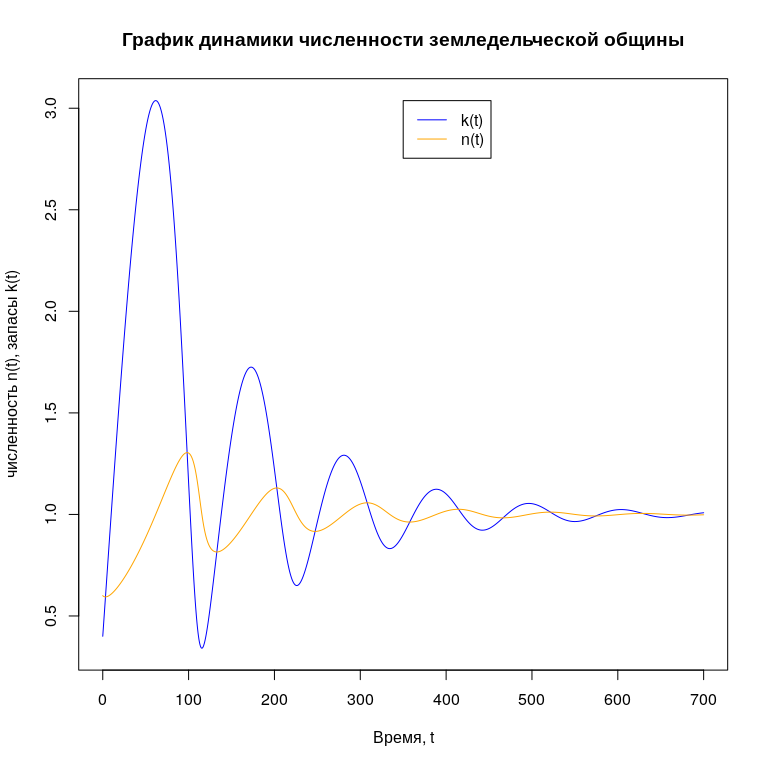
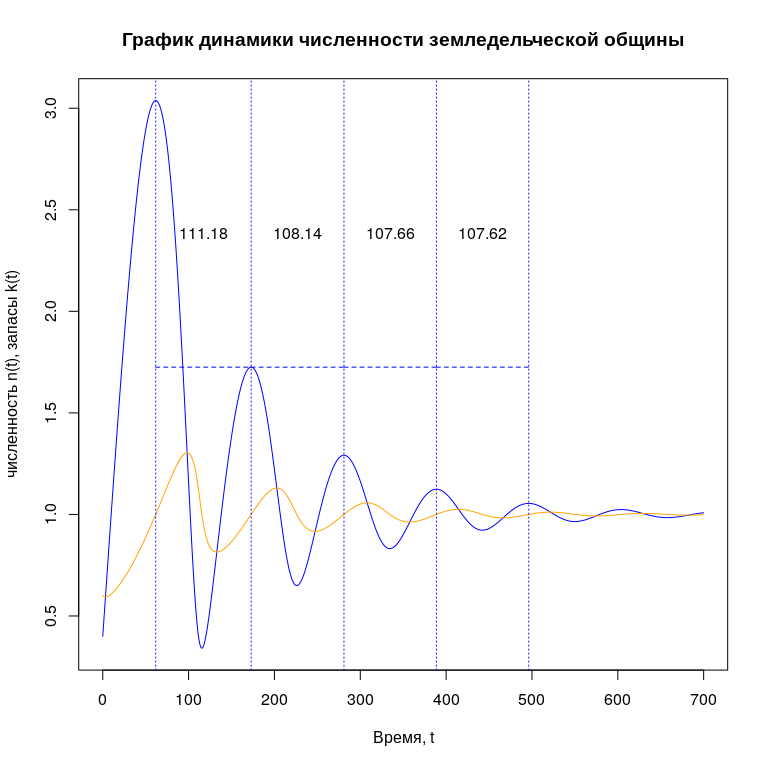
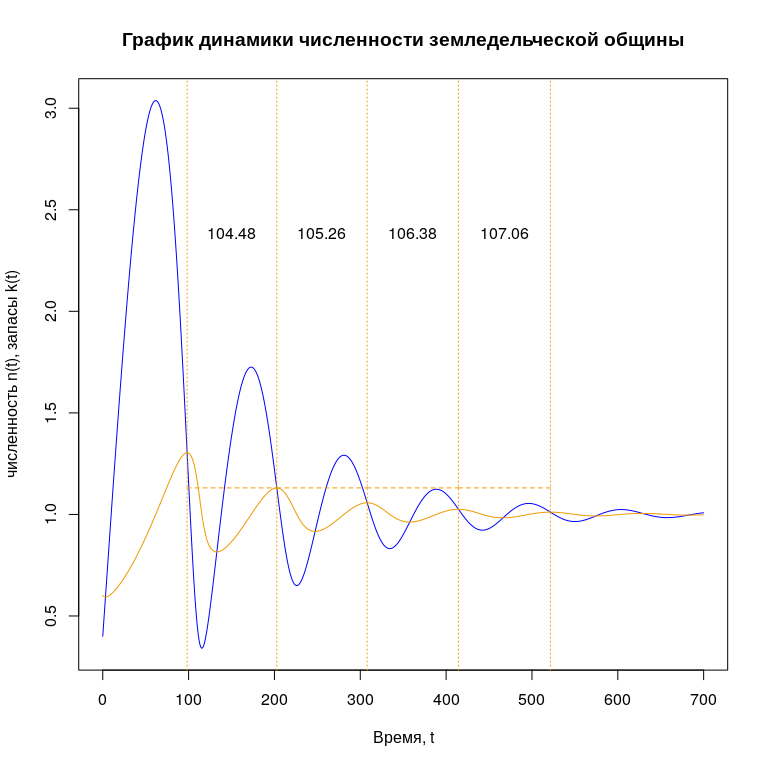
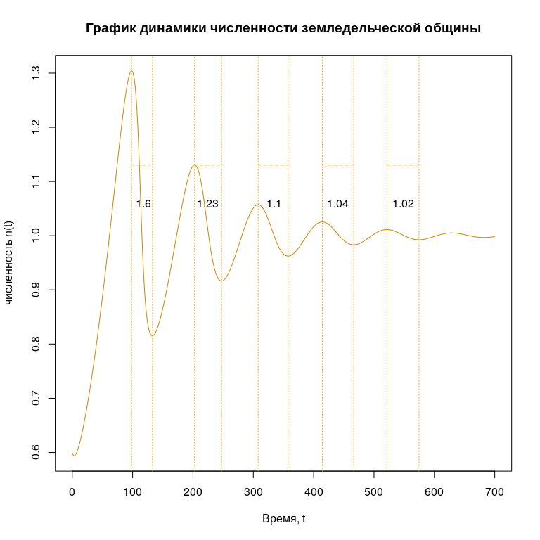
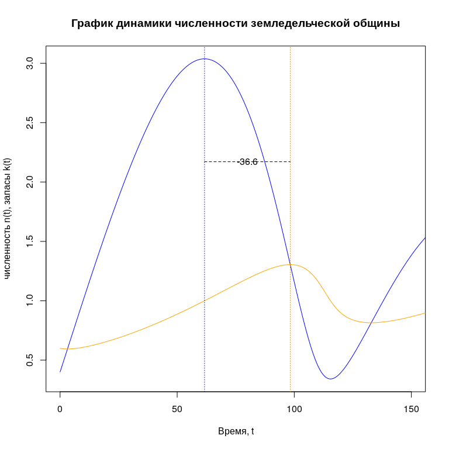
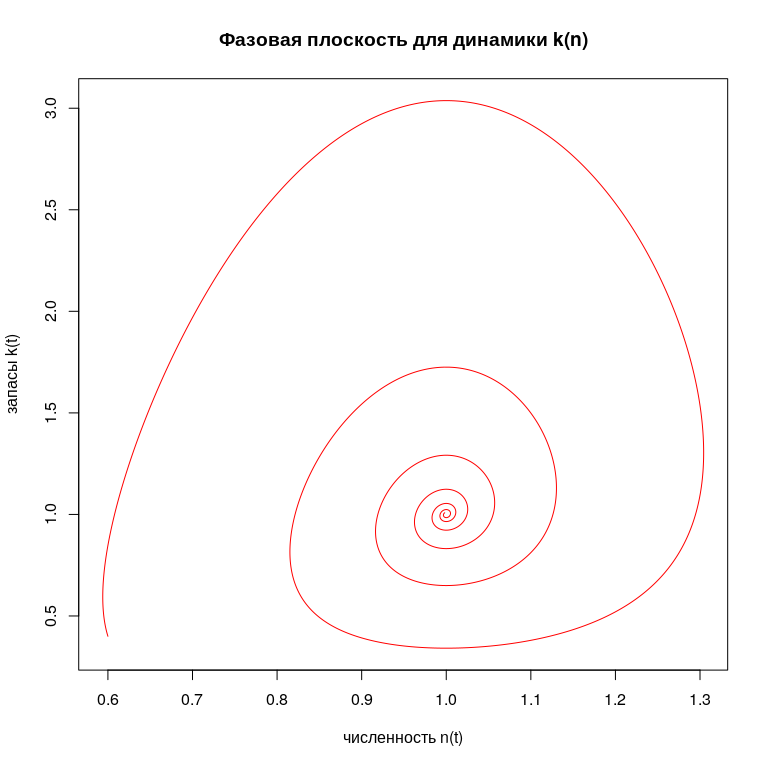
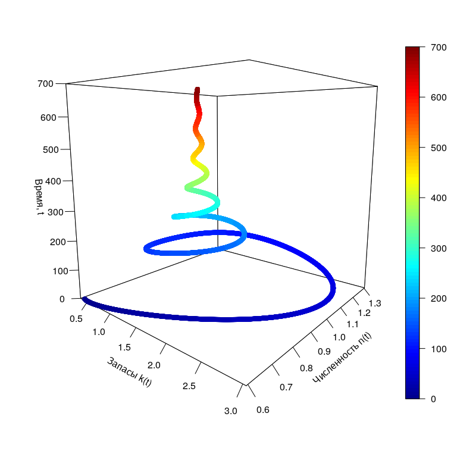

# Качественный анализ модели

## Особые точки системы

Приведём качественный анализ системы, моделирующей динамики численности земледельческой общины:

\[\frac{dn}{dt} = r \cdot n \cdot (1 - \frac{n}{k})\]
\[\frac{dk}{dt} = q \cdot \frac{n}{n \cdot (q-1) + 1} - n\]

Для состояния равновесия получим следующие точки:

\[0 = r \cdot n^* \cdot (1 - \frac{n^*}{k^*})\]
\[0 = q \cdot \frac{n^*}{n^* \cdot (q-1) + 1} - n^*\]

Из первого уравнения получаем два условия на существование решения. Получается, что либо $n^* = k^*$, либо 
$n^* = 0, \forall k^*$. Также из первого уравнения получим ограничение на область допустимых значений точки покоя в виде $k^*\neq0$.

Из второго уравнения, произведя некоторые упрощения получим:
\[q-1 = n^* \cdot (q-1)\]
откуда следует, что в область допустимых решений включается условие $n^* = 1$ или $n^* = 0$.

Тогда получим пару $(n^*, k^*) = (1, 1)$ и $(n^*, k^*) = (0, \forall k^* \neq 0)$

## Анализ системы в первом приближении

Произведем анализ данной системы в первом приближении. Для этого получим от правых частей системы первые производные.

Правые части системы:

\[P(n,k) = r \cdot n \cdot (1 - \frac{n}{k})\]
\[Q(n,k) = q \cdot \frac{n}{n \cdot (q-1) + 1} - n\]

Первые производные системы:

\[\frac{\partial P(n,k)}{\partial n} = r - 2 \frac{r \cdot n}{k}\]
\[\frac{\partial P(n,k)}{\partial k} = -\frac{r\cdot n^2}{k^2}\]
\[\frac{\partial Q(n,k)}{\partial n} = \frac{q}{(n(q-1)+1)^2}-1\]
\[\frac{\partial Q(n,k)}{\partial k} = 0\]

Тогда из системы первого приближения вида:

\[P(n,k) \approx \frac{\partial P(n^*,k^*)}{\partial n} (n - n^*) + \frac{\partial P(n^*,k^*)}{\partial k} (k-k^*)\]
\[Q(n,k) \approx \frac{\partial Q(n^*,k^*)}{\partial n} (n - n^*) + \frac{\partial Q(n^*,k^*)}{\partial k} (k-k^*)\]

Получим для пары значений для особой точки $(n^*, k^*) = (1, 1)$ систему вида:
\[\frac{dn}{dt} =  -r \cdot (n-1) -r \cdot (k-1) = -r\cdot n -r\cdot k -2\cdot r\]
\[\frac{dk}{dt} = \frac{1-q}{q} (n - 1) = \frac{1-q}{q}n - \frac{1-q}{q}\]

Откуда получаем пару значений для корней характеристического уравнения системы первого приближения:
\[\lambda_{1,2} = \frac{r^2}{2} \pm \frac{\sqrt{r^2 + 4\frac{q-1}{q}r}}{2}\]

# Численное решение системы

## Численное решение системы с начальными условиями


```r
r <- 0.015
q <- 1.3
n0 <- 0.6
k0 <- 0.4

population_dynamics <- function(t, y, parms) {
  dn <- parms[1] * y[1] * (1 - y[1]/y[2])
  dk <- parms[2] * (y[1] / (y[1] * (parms[2] - 1) + 1)) - y[1]
  list(c(dn, dk))
}

yini <- c(n = n0, k = k0)
times = seq(0, 700, by = 0.02)
n_k_t <- deSolve::ode(times = times, y = yini, func = population_dynamics, parms = c(r, q))
```


```r
plot(x = n_k_t[, "time"],
     y = n_k_t[, "k"],
     type = "l",
     col = "blue",
     lwd = 1,
     main = "График динамики численности земледельческой общины",
     xlab = "Время, t",
     ylab = "численность n(t), запасы k(t)")
lines(x = n_k_t[, "time"],
     y = n_k_t[, "n"],
     type = "l",
     col = "orange")
legend(x = mean(n_k_t[, "time"]), y = max(n_k_t[, "k"]), 
       legend = c("k(t)", "n(t)"), 
       col = c("blue", "orange"), 
       lty = c(1, 1))
```

<!-- -->


```r
maxes <- function(x) {
  vec <- numeric(length = 0L)
  for (nx in 2:(length(x) - 1)) {
    if ((x[nx] > x[nx - 1]) & (x[nx] > x[nx + 1])) {
      vec <- c(vec, nx)
    }
  }
  return(vec)
}

minis <- function(x) {
  vec <- numeric(length = 0L)
  for (nx in 2:(length(x) - 1)) {
    if ((x[nx] < x[nx - 1]) & (x[nx] < x[nx + 1])) {
      vec <- c(vec, nx)
    }
  }
  return(vec)
}
```


```r
plot(x = n_k_t[, "time"],
     y = n_k_t[, "k"],
     type = "l",
     col = "blue",
     lwd = 1,
     main = "График динамики численности земледельческой общины",
     xlab = "Время, t",
     ylab = "численность n(t), запасы k(t)")
lines(x = n_k_t[, "time"],
     y = n_k_t[, "n"],
     type = "l",
     col = "orange")
abline(v = c(n_k_t[maxes(n_k_t[, "k"])[1:5], "time"]), col = "blue", lty = 3)
segments(x0 = n_k_t[maxes(n_k_t[, "k"])[1:4], "time"], 
         x1 = n_k_t[maxes(n_k_t[, "k"])[2:5], "time"],
         y0 = n_k_t[maxes(n_k_t[, "k"])[2], "k"],
         y1 = n_k_t[maxes(n_k_t[, "k"])[2], "k"],
         col = "blue", lty = 2)
text(x = n_k_t[maxes(n_k_t[, "k"])[1:4], "time"]/2 + n_k_t[maxes(n_k_t[, "k"])[2:5], "time"]/2,
     y = mean(n_k_t[maxes(n_k_t[, "k"])[1:2] , "k"]), 
     labels = c(n_k_t[maxes(n_k_t[, "k"])[2:5], "time"] - n_k_t[maxes(n_k_t[, "k"])[1:4], "time"]))
```

<!-- -->


```r
plot(x = n_k_t[, "time"],
     y = n_k_t[, "k"],
     type = "l",
     col = "blue",
     lwd = 1,
     main = "График динамики численности земледельческой общины",
     xlab = "Время, t",
     ylab = "численность n(t), запасы k(t)")
lines(x = n_k_t[, "time"],
     y = n_k_t[, "n"],
     type = "l",
     col = "orange2")
abline(v = n_k_t[c(maxes(n_k_t[, "n"])[1:5]), "time"], col = "orange2", lty = 3)
segments(x0 = n_k_t[maxes(n_k_t[, "n"])[1:4], "time"], 
         x1 = n_k_t[maxes(n_k_t[, "n"])[2:5], "time"],
         y0 = n_k_t[maxes(n_k_t[, "n"])[2], "k"],
         y1 = n_k_t[maxes(n_k_t[, "n"])[2], "k"],
         col = "orange2", lty = 2)
text(x = n_k_t[maxes(n_k_t[, "n"])[1:4], "time"]/2 + n_k_t[maxes(n_k_t[, "n"])[2:5], "time"]/2,
     y = mean(n_k_t[maxes(n_k_t[, "k"])[1:2] , "k"]), 
     labels = c(n_k_t[maxes(n_k_t[, "n"])[2:5], "time"] - n_k_t[maxes(n_k_t[, "n"])[1:4], "time"]))
```

<!-- -->

```r
plot(x = n_k_t[, "time"],
     y = n_k_t[, "n"],
     type = "l",
     col = "orange3",
     lwd = 1,
     main = "График динамики численности земледельческой общины",
     xlab = "Время, t",
     ylab = "численность n(t)")
abline(v = n_k_t[c(maxes(n_k_t[, "n"])[1:5], minis(n_k_t[, "n"])[2:6]), "time"], col = "orange2", lty = 3)
segments(x0 = n_k_t[maxes(n_k_t[, "n"])[1:5], "time"], 
         x1 = n_k_t[minis(n_k_t[, "n"])[2:6], "time"],
         y0 = n_k_t[maxes(n_k_t[, "n"])[2], "n"],
         y1 = n_k_t[maxes(n_k_t[, "n"])[2], "n"],
         col = "orange2", lty = 2)
text(labels = formatC(n_k_t[maxes(n_k_t[, "n"]), "n"] / n_k_t[minis(n_k_t[, "n"]), "n"][-1], digits = 3), 
     x = n_k_t[maxes(n_k_t[, "n"]), "time"]/2 + n_k_t[minis(n_k_t[, "n"]), "time"][-1]/2, 
     y = n_k_t[maxes(n_k_t[, "n"]), "n"][1]/2 + n_k_t[minis(n_k_t[, "n"]), "n"][2]/2)
```

<!-- -->

```r
plot(x = n_k_t[, "time"],
     y = n_k_t[, "k"],
     type = "l",
     col = "blue",
     lwd = 1,
     main = "График динамики численности земледельческой общины",
     xlab = "Время, t",
     ylab = "численность n(t), запасы k(t)",
     xlim = c(0, 150))
lines(x = n_k_t[, "time"],
     y = n_k_t[, "n"],
     type = "l",
     col = "orange")
abline(v = c(n_k_t[maxes(n_k_t[, "n"]), "time"][1], n_k_t[maxes(n_k_t[, "k"]), "time"][1]), 
       col = c("orange3", "blue"), lty = 3)
segments(x0 = n_k_t[maxes(n_k_t[, "k"]), "time"][1],
         x1 = n_k_t[maxes(n_k_t[, "n"]), "time"][1],
         y0 = mean(c(n_k_t[maxes(n_k_t[, "n"]), "n"][1], n_k_t[maxes(n_k_t[, "k"]), "k"][1])),
         lty = 2)
text(x = mean(c(n_k_t[maxes(n_k_t[, "n"]), "time"][1], n_k_t[maxes(n_k_t[, "k"]), "time"][1])),
     y = mean(c(n_k_t[maxes(n_k_t[, "n"]), "n"][1], n_k_t[maxes(n_k_t[, "k"]), "k"][1])),
     labels = diff(c(n_k_t[maxes(n_k_t[, "n"]), "time"][1], n_k_t[maxes(n_k_t[, "k"]), "time"][1])))
```

<!-- -->


```r
plot(x = n_k_t[, "n"],
     y = n_k_t[, "k"],
     type = "l",
     col = "red",
     lwd = 1,
     main = "Фазовая плоскость для динамики k(n)",
     xlab = "численность n(t)",
     ylab = "запасы k(t)")
```

<!-- -->

```r
plot3D::points3D(x = n_k_t[, "k"],
                 y = n_k_t[, "n"], 
                 z = n_k_t[, "time"],
                 xlab = "Запасы k(t)",
                 ylab = "Численность n(t)",
                 zlab = "Время, t",
                 ticktype = "detailed",
                 nticks = 8,
                 theta = 40,
                 phi = 10)
```

<!-- -->


